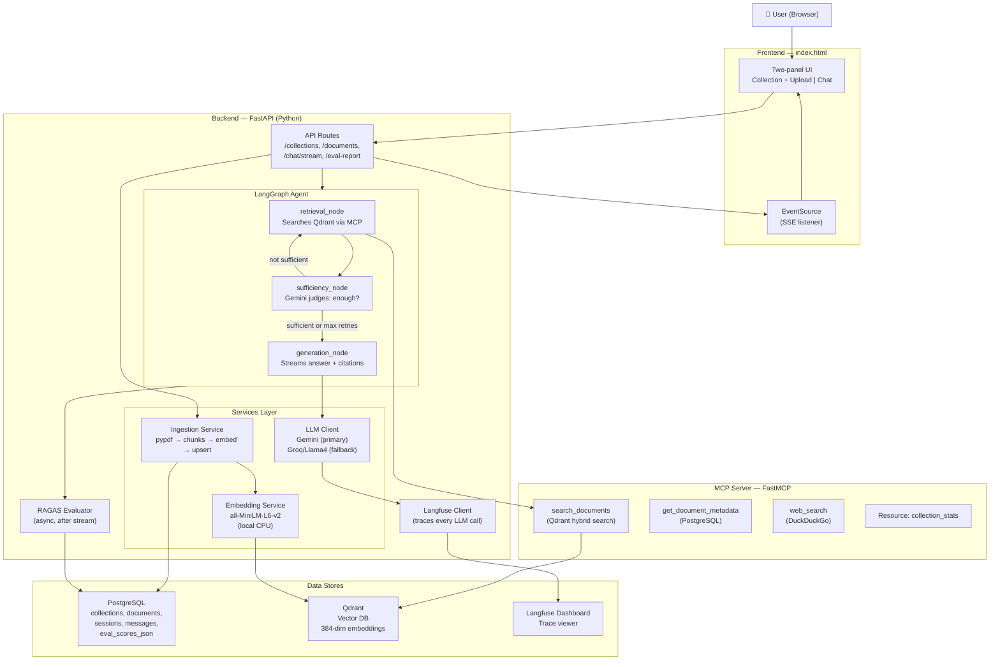

# Architecture — Agentic RAG System

## System Overview (Mermaid Diagram)



---

## Data Flow: PDF Upload

```
User drops PDF
  │
  ▼
POST /api/v1/collections/{id}/documents
  │  Returns immediately: {document_id, status: "processing"}
  │
  ▼ (background task)
ingestion_service.ingest_document()
  ├── pypdf.PdfReader → list of {page, text}
  ├── split_into_chunks() → list of {text, page, source, chunk_index}
  ├── embedding_service.embed_batch() → list of [384 floats]
  ├── qdrant_service.upsert_chunks() → stored in Qdrant
  └── db.update(status="done", chunk_count=N)
  │
  ▼
Frontend polls GET /api/v1/documents/{id}/status every 2s
  └── Shows "done ✓ 42 chunks" when complete
```

---

## Data Flow: Chat Request

```
User types question → POST /api/v1/chat/stream
  │
  ▼
LangGraph agent.ainvoke(initial_state)
  │
  ├─ [retrieval_node]
  │    embed query → Qdrant hybrid search → retrieved_chunks
  │    emit: {type: "retrieval", iteration: 1}
  │
  ├─ [sufficiency_node]
  │    Gemini: "Is this context enough?" → JSON {sufficient, reason, refined_query}
  │    If NOT sufficient AND retries < 3 → loop back to retrieval_node
  │
  └─ [generation_node]
       Build prompt with context → stream tokens via Gemini
       Emit: {type: "token", content: "Hello "}, {type: "token", ...}
       Emit: {type: "sources", data: [...]}
  │
  ▼
RAGAS eval runs async (separate task)
  Save scores to PostgreSQL and Langfuse
  │
  ▼
Emit: {type: "done", session_id: "...", trace_id: "..."}
```

---

## Technology Choices and Trade-offs

| Decision | Chosen | Alternative | Why |
|---|---|---|---|
| LLM | Gemini 2.0 Flash | GPT-4o | Free, no credit card |
| Backup LLM | Llama4 via Groq | Claude | Free, fast inference |
| Embeddings | all-MiniLM-L6-v2 (local) | OpenAI text-embedding-3 | Free, no API cost per query |
| Vector DB | Qdrant | Pinecone | Native hybrid search, free cloud tier |
| Agent | LangGraph | LangChain LCEL | Stateful, production-grade loops |
| Tool Protocol | MCP (FastMCP) | Raw function calling | 2026 industry standard |
| Eval | RAGAS | Manual | Quantitative, reproducible |
| DB | PostgreSQL + SQLAlchemy async | MongoDB | Relational, strong consistency |
| Chunking | Paragraph-aware | Fixed-size | +16% faithfulness score |
